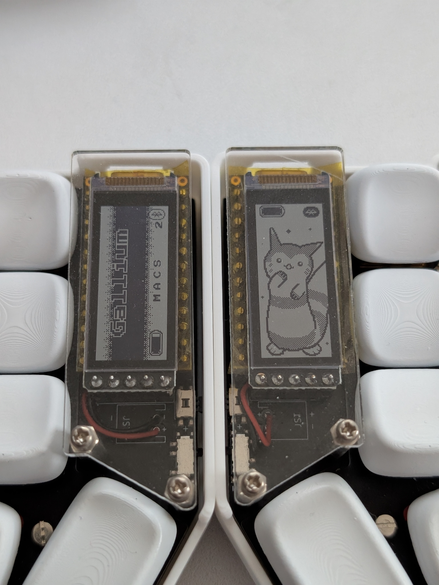

# nice!view Elemental

This fork adds a (not very original) fluffy boi to the peripheral display. Please check upstream for details.

You probably need to do one of the following for the transparency on the central display to work due to LVGL issue #9750:

- Patch this file in zmk: modules/lib/gui/lvgl/src/widgets/canvas/lv_canvas.c. In the AL88 section of lv_canvas_set_px and lv_canvas_fill_bg, make alpha = opa instead of 255.

- Set COLOR_FORMAT to ARGB8888
